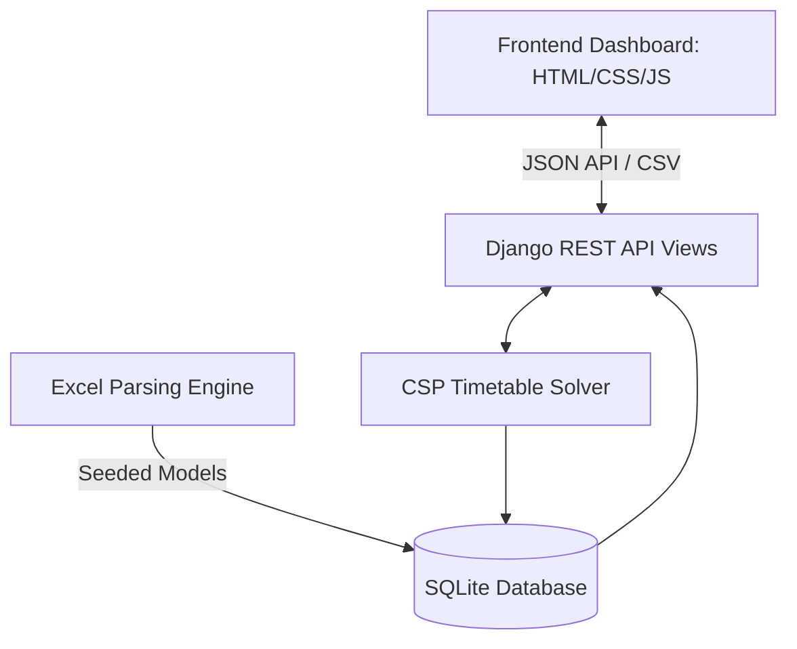

# GIKI Automated Timetable Scheduling System

A state-of-the-art, complete **Django + HTML/CSS/JavaScript** semester project designed for **CS378 (Automated Timetable Scheduling)** at GIKI. This system automates the generation of a clash-free Monday–Friday academic timetable for all faculties and departments while satisfying physical resource boundaries, faculty constraints, and student section schedules.

---

## 🚀 Key Features

*   **Intelligent CSP Solver**: Uses a Constraint Satisfaction Problem (CSP) solver utilizing backtracking search with heuristics, multi-restart logic, and localized swap repair to find feasible schedules within seconds.
*   **Automatic Excel Parsing**: Ingests department course offerings from Excel sheets, matches codes to prospectus curricula, maps sections, infers theory vs. lab status, and dynamically generates course offerings.
*   **Modern Visual Interface**: Sleek vanilla HTML5/CSS3 dashboard featuring modern glassmorphism design, real-time search and filter controls, animated progress bars, export tools, and a dynamic constraint validation card layout.
*   **Hard Constraint Verification**: Explicitly verifies scheduling integrity post-run to guarantee zero double-bookings or session omissions.
*   **Full Data Export**: Provides instant CSV downloads of generated schedules for scheduling administrators.

---

## 🛠️ System Architecture

The application is structured as a monolithic Django application that serves the single-page frontend:



### 1. Technology Stack
*   **Backend Framework**: [Django 5.0.6](https://www.djangoproject.com/)
*   **Web API layer**: [Django REST Framework 3.15.1](https://www.django-rest-framework.org/)
*   **Data Processing**: [Pandas](https://pandas.pydata.org/) & [OpenPyXL](https://openpyxl.readthedocs.io/)
*   **Database**: SQLite (local storage)
*   **Frontend**: Vanilla HTML5, modern CSS3 (with responsive grids, custom scrollbars, animations), and native ES6 JavaScript (handling asynchronous AJAX calls, table rendering, progress animations, and filtering).

### 2. File & Directory Structure
*   `manage.py`: Django command-line utility.
*   [requirements.txt](file:///d:/GIKIASS_M/GIKIASS_COMPLETE_PROJECT/GIKIASS_COMPLETE_PROJECT/requirements.txt): List of Python package dependencies.
*   [db.sqlite3](file:///d:/GIKIASS_M/GIKIASS_COMPLETE_PROJECT/GIKIASS_COMPLETE_PROJECT/db.sqlite3): Local SQLite database holding loaded data and schedules.
*   `data/`: Raw Excel data files:
    *   [Room_and_Lecture_Halls.xlsx](file:///d:/GIKIASS_M/GIKIASS_COMPLETE_PROJECT/GIKIASS_COMPLETE_PROJECT/data/Room_and_Lecture_Halls.xlsx) (Loaded during static initialization).
    *   [GIKI_Prospectus_courses_extracted.xlsx](file:///d:/GIKIASS_M/GIKIASS_COMPLETE_PROJECT/GIKIASS_COMPLETE_PROJECT/data/GIKI_Prospectus_courses_extracted.xlsx) (Curriculum definitions).
    *   [Fall_2025_Courses_by_Faculty.xlsx](file:///d:/GIKIASS_M/GIKIASS_COMPLETE_PROJECT/GIKIASS_COMPLETE_PROJECT/data/Fall_2025_Courses_by_Faculty.xlsx) & [Spring_2026_Courses_by_Faculty.xlsx](file:///d:/GIKIASS_M/GIKIASS_COMPLETE_PROJECT/GIKIASS_COMPLETE_PROJECT/data/Spring_2026_Courses_by_Faculty.xlsx) (Semester offerings).
*   `giki_timetable/`: Django configuration core ([settings.py](file:///d:/GIKIASS_M/GIKIASS_COMPLETE_PROJECT/GIKIASS_COMPLETE_PROJECT/giki_timetable/settings.py), [urls.py](file:///d:/GIKIASS_M/GIKIASS_COMPLETE_PROJECT/GIKIASS_COMPLETE_PROJECT/giki_timetable/urls.py)).
*   `api/`: REST APIs, database schemas ([models.py](file:///d:/GIKIASS_M/GIKIASS_COMPLETE_PROJECT/GIKIASS_COMPLETE_PROJECT/api/models.py)), serializers, controllers ([views.py](file:///d:/GIKIASS_M/GIKIASS_COMPLETE_PROJECT/GIKIASS_COMPLETE_PROJECT/api/views.py)), and excel parsers.
*   `algorithm/`: Core CSP generator module ([timetable_generator.py](file:///d:/GIKIASS_M/GIKIASS_COMPLETE_PROJECT/GIKIASS_COMPLETE_PROJECT/algorithm/timetable_generator.py)).
*   `frontend/`: Static user interface files ([index.html](file:///d:/GIKIASS_M/GIKIASS_COMPLETE_PROJECT/GIKIASS_COMPLETE_PROJECT/frontend/index.html), [styles.css](file:///d:/GIKIASS_M/GIKIASS_COMPLETE_PROJECT/GIKIASS_COMPLETE_PROJECT/frontend/styles.css), [app.js](file:///d:/GIKIASS_M/GIKIASS_COMPLETE_PROJECT/GIKIASS_COMPLETE_PROJECT/frontend/app.js)).

---

## 📋 Timetable Constraints

The system schedules classes into specific combinations of **Rooms** and **Time Slots** (5 days × 8 periods/day = 40 possible slot periods) while adhering to two constraint groups:

### Hard Constraints (Strictly Enforced)
A timetable is deemed **infeasible** if any of these are violated:
1.  **HC1 (Teacher Clash)**: A teacher cannot be scheduled to teach more than one section/class at the same time.
2.  **HC2 (Room Clash)**: A classroom or lecture hall cannot host multiple classes simultaneously.
3.  **HC3 (Section Clash)**: A student group or section (e.g., *BCS-Y3A*) cannot have overlapping lectures.
4.  **HC4 (Weekly Sessions)**: Every course offering must be fully scheduled for its required weekly sessions (e.g., 3 theory lectures or 1 double-period lab session).

### Soft Constraints (Optimized via Penalty Heuristics)
Used to rank candidate slot allocations. The solver attempts to maximize a quality score (0 to 100) by avoiding:
*   **Student Gaps**: Minimizes isolated empty periods between lectures for sections on the same day.
*   **Workload Distribution**: Balances weekly lecture loads across days (Monday–Friday) for both sections and teachers.
*   **Streak Protection**: Penalizes scheduling more than 3 consecutive periods of classes for a section.
*   **Capacity Overfill/Underfill**: Penalizes placing sections in rooms that cannot seat them, while mildly penalizing excessive capacity mismatches (e.g., placing 20 students in a 120-seat hall).
*   **Elective Constraints**: Places elective courses in mid-to-late slots (period > 2) to protect core morning lectures.

---

## 🧮 Solver Algorithm

The scheduling engine ([timetable_generator.py](file:///d:/GIKIASS_M/GIKIASS_COMPLETE_PROJECT/GIKIASS_COMPLETE_PROJECT/algorithm/timetable_generator.py)) formulates scheduling as a **Constraint Satisfaction Problem (CSP)**:

1.  **Variable Definition**: Each weekly session of a course offering (e.g., *Session #2 of CS378*) is a CSP variable.
2.  **Domain Mapping**: The domain is the set of all valid combinations of `(Room, TimeSlot)` that fit the course type (e.g., labs map to laboratories, theory maps to lecture halls).
3.  **Heuristically-Driven Sorting**: Variables are sorted before scheduling:
    *   *Lab sessions* (which require multiple consecutive time slots) are scheduled first.
    *   *Larger classes* and those with heavily loaded teachers/sections are given higher priority.
4.  **Constraint Propagation & Backtracking**: The solver attempts to assign variables sequentially. Candidates are scored based on the soft constraint penalty function, and the lowest penalty option is picked (Least Constraining Value heuristic).
5.  **Multi-Restart Heuristic**: To bypass local minima, the solver performs up to 5 restarts with randomly shuffled variable queues, retaining the best schedule generated.
6.  **Swap Repair Heuristic**: If a variable is unplaceable, the solver looks for candidates blocked by 1 or 2 already scheduled sessions, temporarily removes the blockers, places the target session, and attempts to reschedule the displaced blockers elsewhere. If successful, the swap is committed.
7.  **Post-Generation Verification**: A final validation loop verifies the scheduled assignments against the 4 hard constraints before writing them to the database.

---

## 🛠️ Setup & Installation

### Prerequisites
*   **Python**: Version 3.10 to 3.12 (standard distribution)
*   **Operating System**: Windows / Linux / macOS

### Installation Steps

1.  **Navigate to the workspace**:
    ```powershell
    cd GIKIASS_COMPLETE_PROJECT
    ```

2.  **Create a virtual environment**:
    ```powershell
    python -m venv venv
    ```

3.  **Activate the virtual environment**:
    *   **Windows (PowerShell)**:
        ```powershell
        .\venv\Scripts\Activate.ps1
        ```
    *   **Windows (CMD)**:
        ```cmd
        .\venv\Scripts\activate.bat
        ```
    *   **Linux / macOS**:
        ```bash
        source venv/bin/activate
        ```

4.  **Install dependencies**:
    ```powershell
    pip install -r requirements.txt
    ```

5.  **Apply database migrations**:
    ```powershell
    python manage.py migrate
    ```

6.  **Seed static data (Rooms, Departments, Programs, Prospectus)**:
    ```powershell
    python manage.py load_static_data
    ```

7.  **Run the development server**:
    ```powershell
    python manage.py runserver
    ```

---

## 💻 Recommended User Workflow

Once the server is running:

1.  Open your browser and navigate to **[http://127.0.0.1:8000/](http://127.0.0.1:8000/)**.
2.  **Verify Static Data**: The header dashboard will display the total loaded rooms and time slots.
3.  **Upload Semester Course Offerings**:
    *   Click **Choose File** in the upload section.
    *   Select either [Fall_2025_Courses_by_Faculty.xlsx](file:///d:/GIKIASS_M/GIKIASS_COMPLETE_PROJECT/GIKIASS_COMPLETE_PROJECT/data/Fall_2025_Courses_by_Faculty.xlsx) or [Spring_2026_Courses_by_Faculty.xlsx](file:///d:/GIKIASS_M/GIKIASS_COMPLETE_PROJECT/GIKIASS_COMPLETE_PROJECT/data/Spring_2026_Courses_by_Faculty.xlsx) from the `data/` directory.
    *   Click **Upload Course File**. Wait for the green success message.
4.  **Generate Schedule**:
    *   Select filtering options if you wish to generate for specific departments (e.g. *FCSE*, *FEE*), programs, or years, or leave them as **All**.
    *   Click **Generate Timetable**.
    *   Watch the animated solver progress bar. Once completed, a summary containing the total placed classes, computation time, and the **Soft Constraint Quality Score** will be displayed.
    *   The **Hard Constraint Status Panel** will light up green for successfully met constraints.
5.  **Search & Filter**:
    *   Use the search box to filter the grid in real-time by *Teacher*, *Section*, *Course Code*, or *Room*.
6.  **Export CSV**:
    *   Click **Export CSV** to download a clean, spreadsheet-ready timetable configuration.

---

## 📡 API Reference Documentation

All API endpoints are prefixed with `/api/`.

### 1. System Metadata
*   **Endpoint**: `GET /api/metadata/`
*   **Description**: Retrieves counts for loaded rooms, slots, list of departments, programs, and recent Excel upload histories.
*   **Response**:
    ```json
    {
      "departments": [{"code": "FCSE", "full_name": "Faculty of Computer Sciences and Engineering"}],
      "programs": [{"code": "BCS", "full_name": "Bachelor of Computer Science", "department__code": "FCSE"}],
      "rooms": 138,
      "time_slots": 40,
      "uploads": [{"id": 1, "uploaded_at": "2026-07-06T12:00:00Z", "status": "parsed"}]
    }
    ```

### 2. Upload Course Offerings
*   **Endpoint**: `POST /api/upload/`
*   **Payload**: Multipart form data with key `file` containing the `.xlsx` sheet.
*   **Description**: Parses the courses sheet, maps instructors/credits, creates offerings, and returns validation stats.

### 3. Generate Timetable
*   **Endpoint**: `POST /api/generate/`
*   **Payload**:
    ```json
    {
      "upload_session_id": 1,
      "faculty": "FCSE",
      "program": "BCS",
      "year": "all"
    }
    ```
*   **Description**: Wipes any current schedule and starts the CSP timetable solver.
*   **Response**:
    ```json
    {
      "status": "success",
      "entries_generated": 342,
      "soft_constraint_score": 88.42,
      "generation_time_ms": 782,
      "placed_tasks": 342,
      "total_tasks": 342,
      "hard_constraints": {
        "satisfied": true,
        "total_violations": 0,
        "violations": {}
      }
    }
    ```

### 4. Fetch Timetable Entries
*   **Endpoint**: `GET /api/timetable/`
*   **Query Parameters**: `faculty`, `program`, `year`, `section`, `teacher`, `room`, `day`
*   **Description**: Returns ordered list of generated schedule entries matching query parameters.

### 5. Export Schedule
*   **Endpoint**: `GET /api/timetable/export/`
*   **Description**: Downloads a `.csv` file containing the full generated timetable.

### 6. Clear Schedule
*   **Endpoint**: `DELETE /api/timetable/clear/`
*   **Description**: Wipes all scheduled entries from the database.

---

## 🎨 Visual Features
*   **Dynamic Dark Theme**: Translucent glassmorphism containers (`backdrop-filter: blur`) against a professional dark radial gradient backdrop.
*   **Animated Constraint Statuses**: Status badges that transition from warning orange/yellow/gray to success green as the constraints are satisfied.
*   **Responsive Timetable Grid**: Flexible data table with scrollable overflow wrapping, designed to display perfectly on both administrative monitors and laptops.
